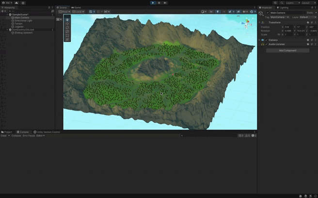

# Introducción a Unity: Realización de una escena 3D

En este trabajo práctico, se llevó a cabo la creación de un paisaje interactivo en Unity utilizando las herramientas de terreno para modelar el entorno. El objetivo principal fue diseñar un escenario natural que simule un entorno montañoso con vegetación, utilizando las capacidades del motor gráfico para gestionar terrenos, aplicar texturas y configurar elementos como árboles y montañas.

Además, se desarrolló un script en C# que permite localizar la posición de cada uno de los objetos presentes en la escena. Este script recorre los objetos que contienen un componente `Transform` y registra su posición en la consola de Unity, permitiendo visualizar las coordenadas exactas de elementos clave del escenario, como la cámara, las luces, el terreno y el jugador. Esto es útil para depuración y análisis del entorno.

## Objetivos del trabajo:
- **Incluir objetos 3D básicos.**
- **Incluir  en el proyecto el paquete Starter Assets.**
- **Incluir un objeto libre de la Asset Store que no sea de los Starter Assets.**
- **Crear un terreno.**
- **Cada objeto debe tener una etiqueta que lo identifique.**
- **Utilizar prefabs de Starter Asset FPS o Third Person**
- **Agregar un script que escriba en la consola la posición de cada objeto que hayas utilizado.**

## Hitos clave:
1. **Colocación de objetos**: Se añadieron objetos básicos, en este caso se utilizó un cilindro que representa al jugador.
3. **Se incluyeron diferentes paquetes de la asset store**, para añadir los arboles y las flores que dieron vida al entorno.
4. **Diseño del terreno**: Se utilizó la herramienta de `Terrain` de Unity para crear un paisaje tridimensional que incluya montañas y vegetación, tal como se muestra en el video.
5. **Localización de objetos**: A través del script en C#, se listaron las posiciones de todos los elementos de la escena para realizar un seguimiento preciso.

