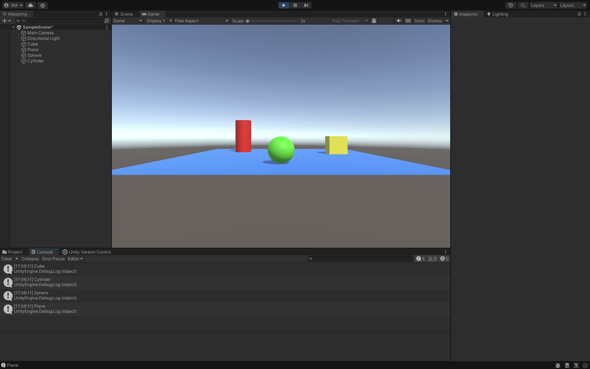

### Descripción del ejercicio

En este ejercicio, se creó una escena simple en Unity que incluye los siguientes elementos:

- Un **plano** que sirve como base para los objetos.
- Tres objetos 3D: un **cubo**, una **esfera** y un **cilindro**, cada uno colocado sobre el plano y con un color diferente.
- Se creó un script llamado `ShowName`, el cual está asociado a cada uno de estos objetos. Al iniciar la escena, este script imprime en la consola de Unity el nombre del objeto correspondiente.
  
Para asignar los colores:
1. Se creó una carpeta llamada `Materials` en el proyecto.
2. Se añadieron materiales con diferentes colores utilizando la propiedad **Albedo** en el **Inspector**.
3. Los materiales se arrastraron a los objetos respectivos en la escena.

Este ejercicio ayuda a familiarizarse con la creación de objetos 3D, la asignación de materiales y el uso de scripts en Unity para interactuar con los objetos.

