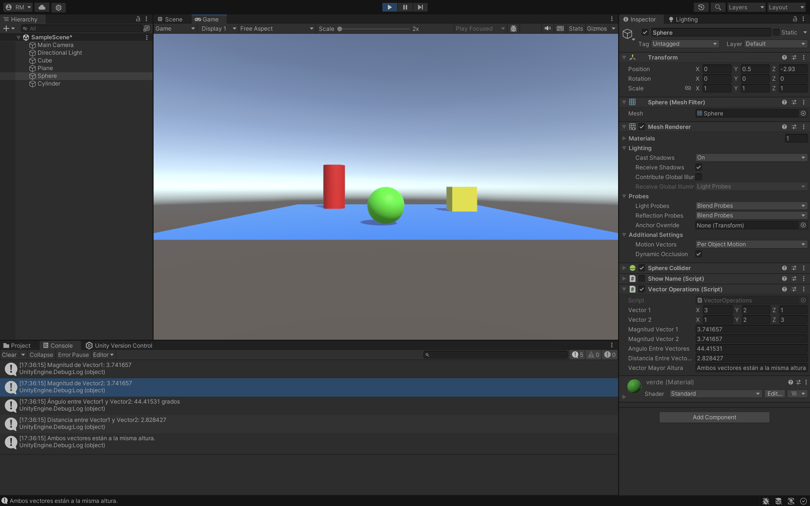

### Descripción del ejercicio

En este ejercicio, se crea un script en Unity asociado a una esfera, en el cual se definen dos variables públicas de tipo `Vector3` para que sus valores puedan ser asignados desde el **Inspector**. El script realiza las siguientes operaciones con los vectores:

1. Calcula y muestra en la consola la **magnitud** de ambos vectores.
2. Calcula el **ángulo** que forman los dos vectores y lo muestra en la consola.
3. Calcula la **distancia** entre los dos vectores y la imprime en la consola.
4. Compara las alturas de ambos vectores (sus componentes `y`) y muestra un mensaje indicando cuál vector tiene una mayor altura.

Además, los valores calculados se muestran en el **Inspector** para facilitar la visualización sin necesidad de recurrir a la consola.

Este ejercicio ayuda a comprender cómo trabajar con vectores en Unity, así como cómo utilizar el Inspector para manipular y mostrar valores de forma dinámica.

