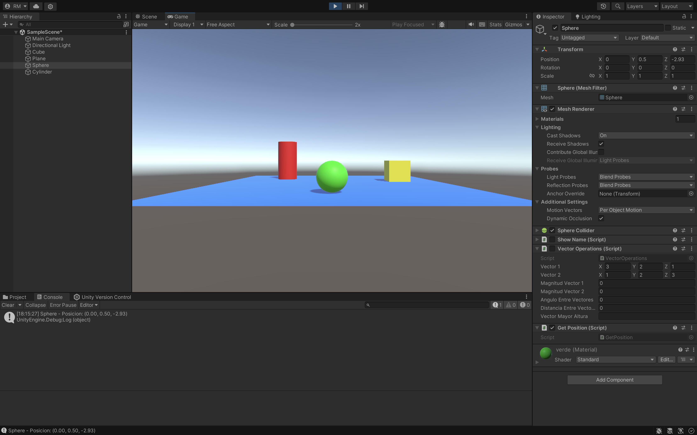

### Descripción del ejercicio

En este ejercicio, el objetivo es mostrar en pantalla la posición del objeto **Esfera** en Unity. La posición de la esfera se puede obtener a través de la propiedad `transform.position`, ya que todos los objetos en Unity tienen un componente `Transform` que almacena la información de su posición, rotación y escala.

Para obtener y mostrar la posición, seguimos estos pasos:
1. **Obtener la posición**: Utilizamos `transform.position`, que devuelve un vector `Vector3` con las coordenadas (x, y, z) de la posición actual de la esfera.
2. **Mostrar la posición en pantalla**: Para visualizar el vector, usamos la función `Debug.Log` que imprime la información en la consola de Unity. Alternativamente, se puede mostrar en la interfaz del juego utilizando la clase `GUI` o `Text` UI.

