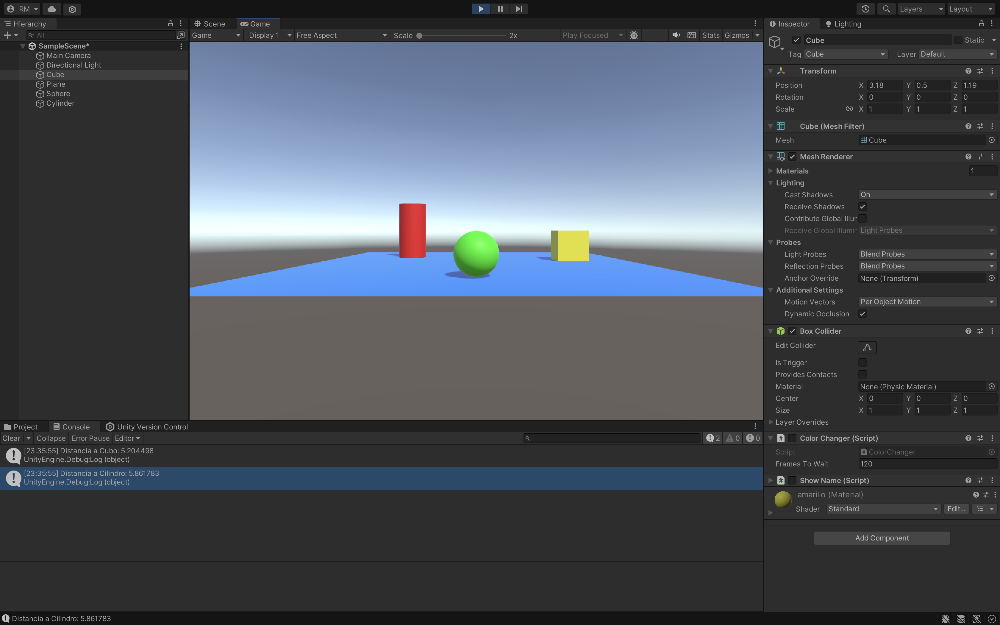

### Descripción del ejercicio

En este ejercicio, se crea un script en Unity que permite calcular y mostrar en la consola la distancia de la esfera a dos objetos: el cubo y el cilindro. La solución emplea las siguientes técnicas:

1. **Búsqueda de objetos por etiquetas**: Se utilizan las etiquetas de Unity para identificar el cubo y el cilindro en la escena. Esto se hace mediante la función `GameObject.FindWithTag()`, que devuelve una referencia a los objetos basados en sus etiquetas.

2. **Cálculo de la distancia**: Con las referencias obtenidas a los objetos cubo y cilindro, se utiliza la función `Vector3.Distance()` para calcular la distancia entre la posición de la esfera y la de cada uno de estos objetos. La posición de un objeto se obtiene a través de su componente `Transform` (`transform.position`).

3. **Salida de la información en la consola**: Las distancias calculadas se muestran en la consola de Unity usando `Debug.Log()` para visualizar los resultados en tiempo real.

Este ejercicio demuestra cómo buscar objetos por etiquetas y calcular distancias entre ellos en un espacio 3D en Unity, facilitando la interacción entre los componentes de una escena.

