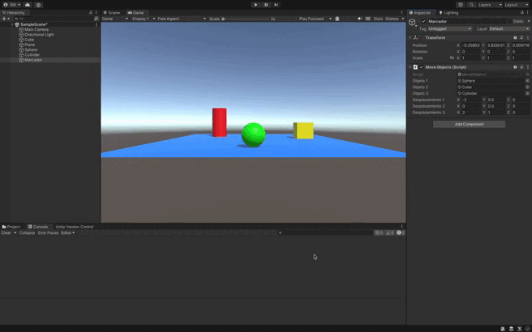

### Descripción del ejercicio

El ejercicio consiste en mover tres objetos en una escena de Unity a nuevas posiciones al presionar la barra espaciadora. Para lograr esto, se configura un desplazamiento para cada objeto utilizando vectores `Vector3`, los cuales representan la variación en los ejes (x, y, z) desde la posición original del objeto. 

#### Detalles de la solución:

1. **Desplazamiento configurado por el usuario**: Cada objeto tiene un vector de desplazamiento público, lo que permite definir desde el **Inspector** cuánto debe moverse el objeto en cada eje (x, y, z).
2. **Detección de la barra espaciadora**: Se utiliza `Input.GetKeyDown(KeyCode.Space)` para detectar si el usuario ha presionado la barra espaciadora.
3. **Actualización de posiciones**: Cuando se detecta la pulsación de la barra espaciadora, los objetos se mueven sumando sus respectivos vectores de desplazamiento a su posición original mediante `transform.position += desplazamiento`.
4. **Salida en consola**: Después del desplazamiento, el script imprime en la consola las nuevas posiciones de los objetos para confirmar el cambio.

Este enfoque facilita mover objetos en respuesta a la interacción del usuario, mientras se mantiene el control de las posiciones y desplazamientos directamente desde el **Inspector**, sin necesidad de modificar el código.

