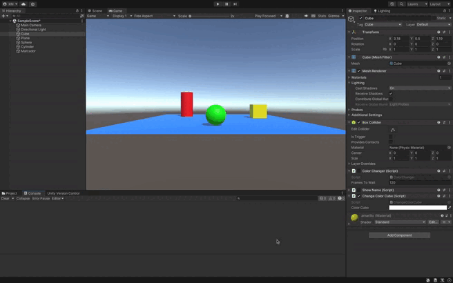

### Descripción del ejercicio

Este ejercicio permite cambiar los colores del cilindro y el cubo en una escena de Unity cuando se presionan ciertas teclas, utilizando un script que permite elegir los colores desde el **Inspector**.

- **Interacción del usuario**: El color del cilindro se cambia al presionar la tecla **C**, y el color del cubo se cambia al presionar la **flecha hacia arriba**.
- **Selección de colores**: Los colores de ambos objetos pueden configurarse desde el **Inspector** de Unity, lo que proporciona flexibilidad al usuario sin necesidad de modificar el código.
- **Cambio de color**: A través del componente `Renderer` de cada objeto, se accede a su material para actualizar su color con los valores seleccionados en el **Inspector**.

Este enfoque facilita la personalización dinámica de los colores en función de la interacción del usuario, mientras que el uso del **Inspector** permite ajustar los colores de manera sencilla y rápida.

