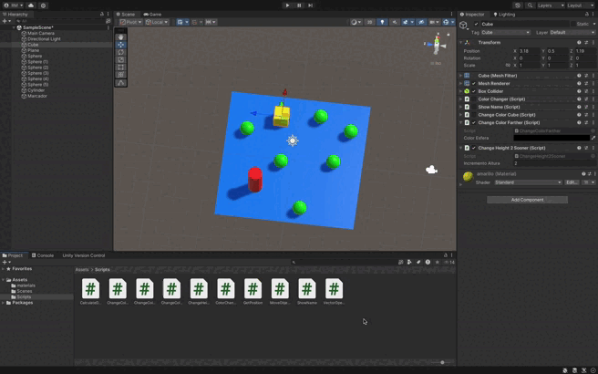

### Descripción del ejercicio

Este script en Unity tiene dos funcionalidades principales:

1. **Encontrar las dos esferas más cercanas** a un objeto y aumentar su altura.
2. **Cambiar el color de la esfera más lejana** al presionar la barra espaciadora.

#### Funcionalidad 1: Aumentar la altura de las esferas más cercanas
- El script busca todas las esferas en la escena que tienen la etiqueta `"type2"`.
- Utiliza `Vector3.Distance()` para calcular las distancias entre el objeto que contiene el script y cada esfera con la etiqueta `"type2"`.
- Se identifican las **dos esferas más cercanas**, y se aumenta su altura modificando su escala en el eje Y. 
- El incremento de altura se puede ajustar desde el **Inspector** mediante la variable pública `incrementoAltura`.

#### Funcionalidad 2: Cambiar el color de la esfera más lejana al presionar la barra espaciadora
- El script también busca todas las esferas con la etiqueta `"type2"` para determinar cuál es la **más lejana** del objeto que contiene el script.
- Cuando el jugador presiona la barra espaciadora (`KeyCode.Space`), el color de la esfera más lejana se cambia al color seleccionado en el **Inspector**.
- La detección de la distancia más lejana se realiza utilizando `Vector3.Distance()` y se actualiza en cada pulsación de la barra espaciadora.

#### Características adicionales:
- **Incremento de altura**: Las esferas más cercanas aumentan su altura ajustando su escala en el eje Y, lo cual es configurable desde el Inspector.
- **Cambio de color**: El color de la esfera más lejana se puede configurar fácilmente desde el Inspector, utilizando la variable pública `colorEsfera`.

#### Resumen:
Este script combina dos interacciones dinámicas:
- Aumentar la altura de las esferas más cercanas al objeto que contiene el script.
- Cambiar el color de la esfera más lejana cuando se presiona la barra espaciadora.

Ambas funcionalidades permiten una interacción visual y espacial clara con los objetos de la escena, proporcionando una experiencia interactiva y personalizable a través del Inspector.

