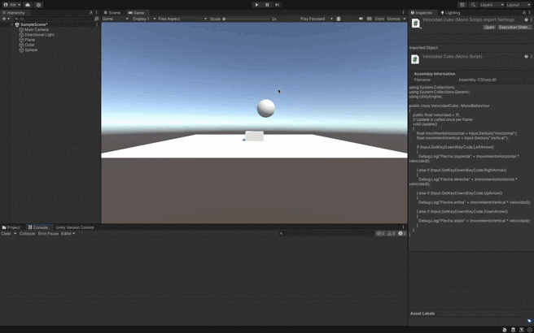

# Control de Cubo en Unity con Input.GetKey

Este proyecto permite controlar el movimiento de un cubo usando las teclas de flechas. Mientras las teclas están presionadas, se muestra en la consola el resultado de multiplicar la velocidad por los ejes `Horizontal` y `Vertical`.

## Funcionamiento

- **Teclas soportadas**: `UpArrow`, `DownArrow`, `LeftArrow`, `RightArrow`.
- La velocidad es configurable desde el inspector.
- Los valores se muestran en la consola mientras las teclas están presionadas.

