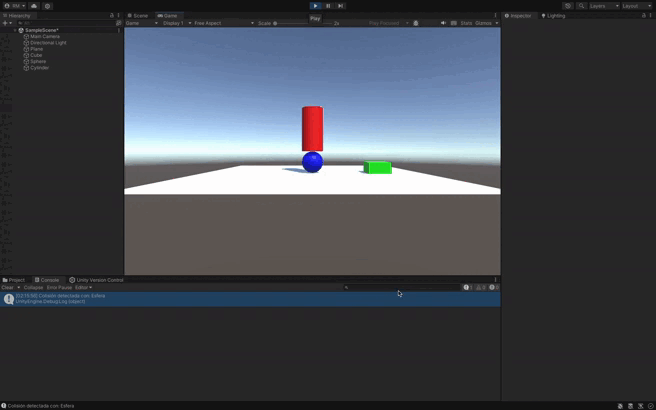

### Resumen: Configuración del Cubo como Cinemático y la Esfera como Física

#### 1. Configurar el Cubo como Objeto Cinemático
- Selecciona el **Cubo** en la jerarquía de Unity.
- En el **Inspector**, añade un **Rigidbody** si no lo tiene y marca la casilla **Is Kinematic**.
- Verifica que el cubo tenga un **BoxCollider** para detectar colisiones.

#### 2. Configurar la Esfera como Objeto Físico
- Selecciona la **Esfera** en la jerarquía de Unity.
- En el **Inspector**, añade un **Rigidbody** si no lo tiene y asegúrate de que **Is Kinematic** esté **desmarcado**.
- Verifica que la esfera tenga un **SphereCollider** para detectar colisiones.

#### 3. Modificar el Script para Detectar Colisiones
- Utiliza el siguiente script para detectar colisiones entre el cubo y la esfera:

