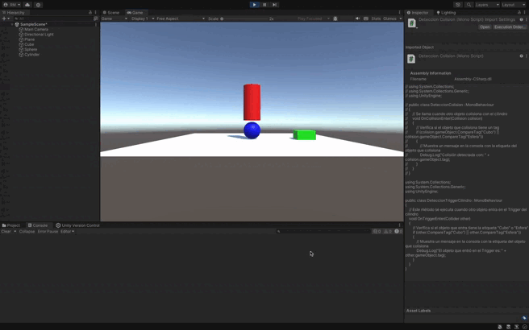

### Resumen: Configuración del Cilindro como Objeto de Tipo **Trigger**

#### 1. Configurar el Cilindro como Trigger
- Selecciona el **Cilindro** en la jerarquía de Unity.
- En el **Inspector**, asegúrate de que el cilindro tenga un **Collider** (por ejemplo, `CapsuleCollider` o `BoxCollider`).
- Marca la opción **Is Trigger** en el **Collider**.
- Elimina o mantén el **Rigidbody**, dependiendo de si deseas que el cilindro tenga comportamiento físico. En este caso, lo más común es quitarlo.

#### 2. Modificar el Script para Detectar Triggers
- Cambia el script para que detecte cuando el cubo o la esfera atraviesen el cilindro, utilizando `OnTriggerEnter()` en lugar de `OnCollisionEnter()`.

