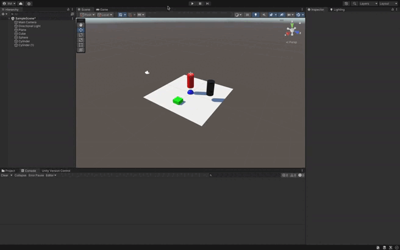

### Configuración y Movimiento del Cilindro con Diferente Color

En este ejercicio, agregaremos un cilindro de color diferente y lo configuraremos como un objeto físico. Este cilindro será controlado mediante teclas, y aplicaremos distintas configuraciones de masa y comportamiento a la esfera. Además, probaremos variaciones en la fricción del cilindro para observar los efectos en el movimiento.

#### Pasos a Seguir:

### 1. Agregar el Cilindro y Configurarlo como Objeto Físico

**Añadir el Cilindro:**
- En el menú de Unity, ve a **GameObject > 3D Object > Cylinder** para agregar un cilindro a la escena.
- Cámbiale el color seleccionando el cilindro y en el **Inspector**, añade un **Material** con el color deseado.

**Configurar el Cilindro como Objeto Físico:**
- Añade un **Rigidbody** en el **Inspector** si no lo tiene.
- Asegúrate de que **Is Kinematic** esté **desmarcado**, para que el cilindro se vea afectado por las fuerzas físicas.
- Asegúrate de que tenga un **Collider** (como `CapsuleCollider` o `BoxCollider`).

### 2. Prueba de Diferentes Configuraciones para la Esfera

#### Configuración de la Esfera Física:

- **Masa 10 veces mayor que el cilindro**: Cambia la masa de la esfera en el componente **Rigidbody** a un valor 10 veces mayor que el cilindro. Observa cómo el cilindro es menos efectivo al empujar la esfera debido a la gran diferencia de masas.
  
- **Masa 10 veces menor que el cilindro**: Cambia la masa de la esfera a un valor 10 veces menor. El cilindro ahora podrá empujar la esfera con mayor facilidad y a una mayor velocidad.
  
- **Esfera Cinemática**: Activa la opción **Is Kinematic** en el **Rigidbody** de la esfera. Esto hará que la esfera no se vea afectada por las fuerzas físicas, y el cilindro no podrá moverla. Solo podrás mover la esfera mediante scripts.
  
- **Esfera como Trigger**: Marca **Is Trigger** en el **Collider** de la esfera. El cilindro atravesará la esfera sin colisionar, pero el evento `OnTriggerEnter()` podrá ser detectado.

### 3. Probar la Configuración de Fricción del Cilindro

- **Duplicar la fricción**: En el **Collider** del cilindro, ajusta el **Physic Material**. Puedes duplicar la fricción (el valor de **Dynamic Friction** y **Static Friction**). Esto hará que el cilindro tenga más dificultad para moverse o detenerse rápidamente.
  
- **Sin fricción**: Cambia la fricción a un valor bajo o 0. El cilindro se moverá mucho más libremente, con menos resistencia.

### 4. Resultados Posibles

- **Masa Mayor en la Esfera**: El cilindro será incapaz de mover la esfera fácilmente, debido a la diferencia de masa.
  
- **Masa Menor en la Esfera**: La esfera se moverá con mucha más facilidad y podrá ser empujada por el cilindro.
  
- **Esfera Cinemática**: La esfera no será afectada por las fuerzas físicas. El cilindro no podrá empujarla, y se mantendrá inmóvil a menos que se mueva mediante scripts.
  
- **Esfera como Trigger**: El cilindro atravesará la esfera sin colisionar físicamente, pero el evento de trigger se activará.
  
- **Fricción Alta**: El cilindro se moverá más lentamente o con más dificultad al detenerse debido a la fricción.
  
- **Fricción Baja o Nula**: El cilindro se moverá más rápidamente, con menos resistencia al movimiento.

### Conclusión

Este ejercicio te permite explorar cómo las configuraciones de masa, fricción y comportamiento físico (cinemático o trigger) afectan la interacción entre el cilindro y la esfera en la escena. La posibilidad de controlar el cilindro mediante teclas ofrece un enfoque interactivo para observar cómo los cambios en las propiedades físicas influyen en la dinámica de los objetos en Unity.

