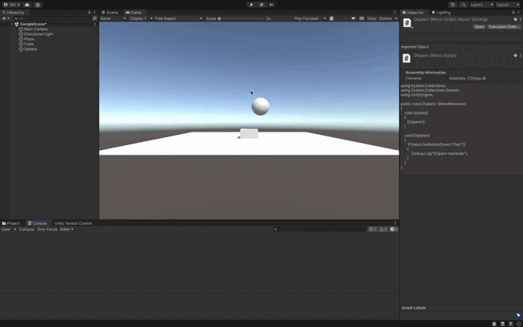

## Descripción de la Solución

El problema consiste en imprimir un mensaje en la consola cada vez que se detecta la acción de disparo, vinculada a la tecla `H`. La solución consiste en mapear la tecla `H` a la función de disparo utilizando el **Input Manager** en Unity, que permite configurar la entrada de manera centralizada.

Al usar la función `Input.GetButtonDown("Fire1")`, se detecta la acción de disparo cuando se presiona la tecla asignada. De esta manera, cada vez que se pulsa la tecla `H`, se ejecuta la acción y se imprime el mensaje "Disparo realizado" en la consola, representando el disparo del jugador.

