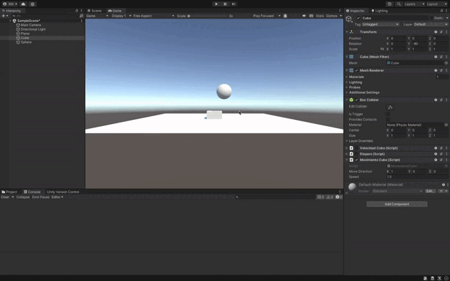

## Descripción de la Solución

Este script en Unity permite mover un cubo en la dirección especificada por un vector `moveDirection` y a una velocidad determinada por `speed`. Ambos valores pueden ser modificados desde el Inspector para ajustar el comportamiento del movimiento en tiempo de ejecución.

El cubo se traslada utilizando el método `Translate()`, que aplica el movimiento en cada fotograma, teniendo en cuenta el tiempo transcurrido (`Time.deltaTime`) para asegurar un movimiento suave y consistente. El script está diseñado para que el cubo comience en una posición con `y = 0`, y la dirección y velocidad del movimiento se pueden ajustar desde el inspector.

### Situaciones evaluadas:
1. **Duplicar las coordenadas de la dirección del movimiento**
   - Cuando se duplican las coordenadas de `moveDirection`, por ejemplo, de `(1, 0, 0)` a `(2, 0, 0)`, el cubo se moverá en la misma dirección (eje X), pero el doble de rápido, ya que el vector que define la dirección tiene una magnitud mayor. Es como si aumentáramos la velocidad sin tocar la variable `speed`, porque el vector de dirección determina cuánta distancia recorre en cada frame.

2. **Duplicar la velocidad manteniendo la dirección del movimiento**
   - Si duplicamos la velocidad, por ejemplo, de `2f` a `4f`, el cubo se moverá más rápido en la misma dirección que antes. Esto sucede porque la multiplicación de la velocidad por el tiempo (`Time.deltaTime`) afecta directamente cuánto se traslada el cubo en cada frame. Al mantener la dirección, solo aumentamos la rapidez con la que se desplaza en esa trayectoria.

3. **Usar una velocidad menor que 1**
   - Al reducir la velocidad por debajo de 1, por ejemplo, `0.5f`, el cubo se moverá más lentamente en la misma dirección. Esto es porque la distancia recorrida en cada frame es menor, lo que provoca un movimiento más suave y lento. En este caso, el cubo sigue moviéndose de manera continua, pero a una fracción de la velocidad original.

4. **La posición del cubo tiene `y > 0`**
   - Si la posición inicial del cubo se cambia a un valor donde `y > 0` (por ejemplo, `y = 2`), el cubo comenzará en una posición elevada en el eje Y. Sin embargo, su movimiento seguirá siendo en la dirección especificada por `moveDirection`, que no incluye un componente vertical si `moveDirection.y = 0`. Esto significa que, aunque el cubo empieza más alto, continuará moviéndose horizontalmente si no se modifica el componente Y de la dirección.

5. **Intercambiar el movimiento relativo al sistema de referencia local y el mundial**
   - Cuando el movimiento se define en el **sistema de referencia mundial** (`Space.World`), el cubo se mueve según las coordenadas globales del mundo, independientemente de su orientación. Si cambiamos a **sistema de referencia local** (`Space.Self`), el cubo se moverá en función de su propia rotación. Por ejemplo, si el cubo está rotado, moverse hacia adelante en el sistema local significará moverse en la dirección en la que el cubo está "mirando", no necesariamente en el eje Z global.

