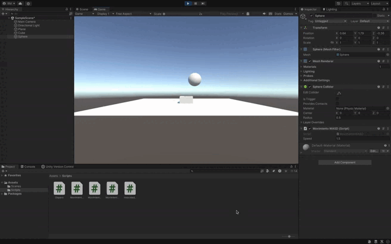

### Descripción para la Solución de Movimiento del Cubo y la Esfera

En esta solución se implementa el movimiento de dos objetos en Unity utilizando dos controles de teclado distintos: las teclas de flechas para el cubo y las teclas `WASD` para la esfera. Ambos objetos tienen una velocidad predefinida (`speed`) que puede ser ajustada desde el inspector en Unity.

#### 1. **Movimiento de la Esfera con Teclas `WASD`**:
   - La esfera se mueve en los ejes horizontal (X) y vertical (Y).
   - El método `Input.GetKey()` captura las teclas `W`, `A`, `S`, y `D`:
     - `W`: mueve la esfera hacia arriba (incrementa en el eje Y).
     - `S`: mueve la esfera hacia abajo (decrementa en el eje Y).
     - `A`: mueve la esfera hacia la izquierda (decrementa en el eje X).
     - `D`: mueve la esfera hacia la derecha (incrementa en el eje X).
   - El movimiento se aplica mediante `Transform.Translate()` usando un vector de dirección construido con los valores de desplazamiento y multiplicado por la velocidad (`speed`).

#### 2. **Movimiento del Cubo con Teclas de Flecha**:
   - El cubo se mueve también en los ejes horizontal (X) y vertical (Y).
   - El método `Input.GetKey()` captura las teclas de flecha (`UpArrow`, `DownArrow`, `LeftArrow`, `RightArrow`):
     - `UpArrow`: mueve el cubo hacia arriba (incrementa en el eje Y).
     - `DownArrow`: mueve el cubo hacia abajo (decrementa en el eje Y).
     - `LeftArrow`: mueve el cubo hacia la izquierda (decrementa en el eje X).
     - `RightArrow`: mueve el cubo hacia la derecha (incrementa en el eje X).
   - De igual manera, el movimiento se aplica mediante `Transform.Translate()`, con un vector de dirección que es multiplicado por la velocidad (`speed`).

