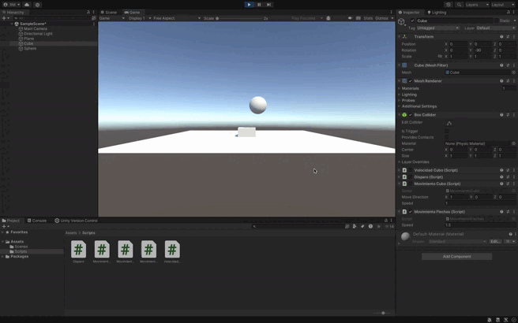

### Descripción para la Solución de Movimiento del Cubo y la Esfera utilizando `Time.deltaTime`

En este ejercicio, se repite el movimiento del cubo y la esfera, pero esta vez se utiliza `Time.deltaTime` para asegurar que el movimiento sea independiente de la tasa de frames por segundo (FPS). Esto es crucial para garantizar que el movimiento sea consistente en diferentes dispositivos, ya que sin `Time.deltaTime`, la velocidad de los objetos dependerá de la cantidad de frames procesados por segundo, lo que podría hacer que los objetos se muevan más rápido o más lento dependiendo del rendimiento del hardware.

#### 1. **Movimiento de la Esfera con Teclas `WASD`**:
   - La lógica es similar a la solución anterior, pero esta vez se multiplica la dirección del movimiento por `Time.deltaTime` para normalizar la velocidad en cada frame.
   - `Time.deltaTime` representa el tiempo transcurrido entre un frame y el siguiente, haciendo que el desplazamiento sea uniforme sin importar la tasa de frames.

#### 2. **Movimiento del Cubo con Teclas de Flecha**:
   - El cubo sigue moviéndose con las teclas de flecha, pero ahora también se aplica `Time.deltaTime` para que el desplazamiento sea proporcional al tiempo transcurrido en cada frame.

### Diferencias Clave con la Solución Anterior:
- **Consistencia del Movimiento**: En la solución sin `Time.deltaTime`, el cubo y la esfera se mueven más rápido o más lento dependiendo del rendimiento del dispositivo (cantidad de frames por segundo). Al agregar `Time.deltaTime`, el movimiento se regula para que sea uniforme sin importar la tasa de frames.
- **Dependencia del Hardware**: Usar `Time.deltaTime` elimina la dependencia del hardware o la velocidad de procesamiento del dispositivo, garantizando que la velocidad establecida sea siempre la misma.

