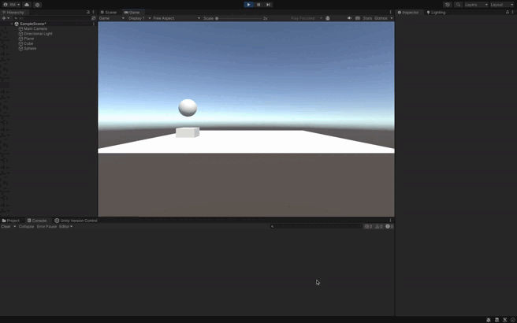

### Descripción de la Función `MoverCuboHaciaEsfera`

La función `MoverCuboHaciaEsfera` permite mover el cubo hacia la posición de la esfera, manteniendo un avance constante sin importar la distancia entre ellos. A continuación se describen los pasos principales:

1. **Cálculo de la dirección**:
   - Se calcula el vector que une la posición del cubo con la posición de la esfera mediante la resta: `esfera.position - cubo.position`.
   - Este vector se normaliza utilizando `.normalized` para obtener una magnitud de 1, asegurando que el movimiento del cubo no dependa de la distancia entre los dos objetos.

2. **Mantener la altura del cubo**:
   - La componente Y del vector de dirección se fija en 0 (`direccion.y = 0`), de modo que el cubo no modifique su altura durante el desplazamiento.

3. **Aplicar movimiento**:
   - El cubo se desplaza en la dirección calculada utilizando `Translate()`, y se multiplica por la velocidad (`speed`) y `Time.deltaTime` para garantizar un movimiento fluido y constante en el espacio global.

