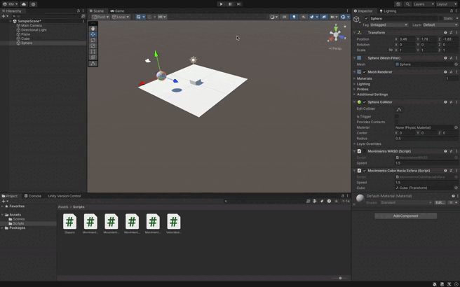

### Descripción de la Función `GirarCuboHaciaEsfera`

La función `GirarCuboHaciaEsfera` permite que el cubo gire para mirar hacia la esfera, ajustando su rotación para que siempre apunte hacia la posición de la esfera en el plano horizontal (X-Z), sin modificar su altura.

1. **Cálculo de la posición objetivo**:
   - Se crea un vector de posición para la esfera que iguala la altura del cubo, usando `esfera.position.x` y `esfera.position.z` pero manteniendo la misma altura en el eje Y que el cubo (`cubo.position.y`).

2. **Rotación del cubo**:
   - El método `LookAt()` se utiliza para hacer que el cubo se oriente hacia la posición objetivo (la esfera en el plano horizontal), rotando solo sobre los ejes X y Z.

