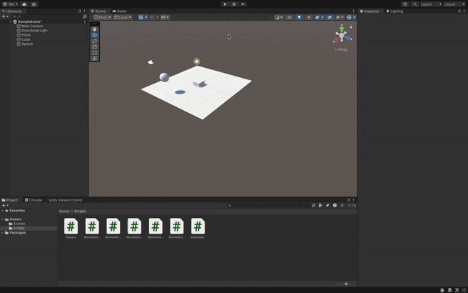

### Descripción de la Solución para Girar y Avanzar en la Dirección Hacia Adelante

En este ejercicio, el objetivo es hacer que un objeto (por ejemplo, un cubo) gire utilizando el eje "Horizontal" (teclas izquierda y derecha) y que avance siempre en la dirección hacia adelante, definida por el vector `transform.forward`.

#### 1. **Giro con el Eje "Horizontal"**:
   - Utilizamos `Input.GetAxis("Horizontal")` para capturar la entrada de las teclas de flechas izquierda/derecha o `A`/`D`.
   - El objeto rota sobre el eje Y (giro en el plano horizontal) utilizando `transform.Rotate()`. La rotación es controlada por la entrada del jugador (teclas) y la velocidad de giro definida en la variable `velocidadGiro`.

#### 2. **Avance en la Dirección Hacia Adelante**:
   - La propiedad `transform.forward` se utiliza para obtener la dirección hacia adelante del objeto. Este vector siempre apunta hacia la dirección en la que el objeto está orientado.
   - Utilizamos `Translate()` para mover el objeto hacia adelante a lo largo del eje Z, garantizando que avance en la dirección a la que está mirando.

#### 3. **Depuración con `Debug.DrawRay`**:
   - Para visualizar hacia dónde se está moviendo el objeto, usamos `Debug.DrawRay()`. Esto dibuja un rayo desde la posición del objeto en la dirección de `transform.forward`.
   - Este rayo es visible en la vista de **Escena** y ayuda a verificar la dirección de avance del objeto.

