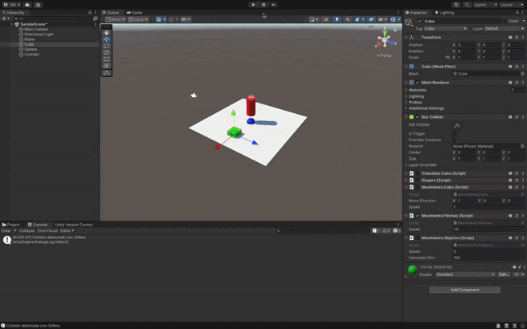

### Descripción de la Solución para Detectar Colisiones con el Cilindro

En este ejercicio, el cilindro se configura como un objeto físico capaz de detectar colisiones con otros objetos (el cubo y la esfera). La solución implica los siguientes pasos:

1. **Agregar Componentes Físicos al Cilindro**:
   - Se añade un **Rigidbody** y un **Collider** al cilindro para que pueda interactuar físicamente con el cubo y la esfera.
   - Asegúrate de que el cubo y la esfera también tengan **Colliders** para detectar las colisiones.

2. **Detectar Colisiones**:
   - Se utiliza el método `OnCollisionEnter(Collision colision)` en un script asociado al cilindro. Este método detecta cuando un objeto colisiona con el cilindro.
   - Cuando ocurre la colisión, el script verifica la etiqueta del objeto que colisiona (`"Cubo"` o `"Esfera"`) y muestra un mensaje en la consola con la etiqueta del objeto.

