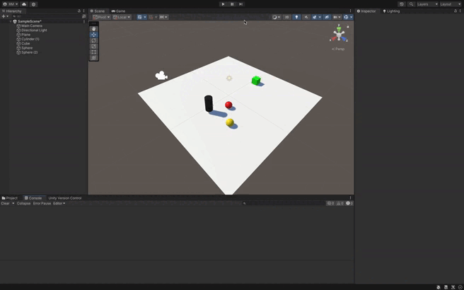
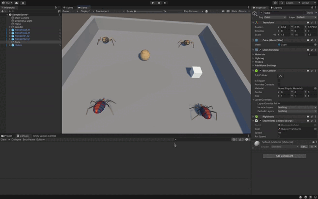

# Descripción

Este proyecto está basado en Unity y tiene como objetivo implementar una mecánica en la que, cuando un **cubo** colisiona con un **cilindro**, las **esferas de tipo 1** se mueven hacia las **esferas de tipo 2** fijadas previamente, mientras que las **esferas de tipo 2** se mueven hacia el cilindro que ha colisionado.

## Estructura del Proyecto

El proyecto consta de tres scripts principales:

1. **CylinderController.cs**: Maneja la detección de colisiones entre el cubo y el cilindro.
2. **EsferasTipo1Controller.cs**: Controla el movimiento de las esferas de tipo 1 hacia una esfera de tipo 2.
3. **EsferasTipo2Controller.cs**: Controla el movimiento de las esferas de tipo 2 hacia el cilindro que colisionó con el cubo.

## Descripción de la Solución

### 1. CylinderController.cs

Este script está asociado al **cilindro**. Su función es detectar cuándo el **cubo** colisiona con el cilindro usando el evento `OnCollisionEnter`. Una vez que la colisión ocurre, se emite un evento estático `OnCuboCollision` al que las esferas están suscritas.

**Método clave**:
- `OnCollisionEnter`: Detecta la colisión del cubo con el cilindro y lanza el evento, enviando la referencia del cilindro para que las esferas puedan reaccionar.

### 2. EsferasTipo1Controller.cs

Este script está asociado a las **esferas de tipo 1**. Al recibir el evento de colisión del cilindro, las esferas de tipo 1 se dirigen hacia las **esferas de tipo 2** predeterminadas. El movimiento se realiza usando el método `Rigidbody.MovePosition`, lo que garantiza que el movimiento se realice dentro del sistema de física de Unity.

**Métodos clave**:
- `OnEnable`: Suscribe la esfera al evento `OnCuboCollision`.
- `MoverHaciaEsferaTipo2`: Calcula la dirección hacia la esfera de tipo 2 y mueve la esfera de tipo 1 hacia ella.
- `FixedUpdate`: Realiza el movimiento hacia la esfera de tipo 2 en cada frame de física.

### 3. EsferasTipo2Controller.cs

Este script está asociado a las **esferas de tipo 2**. Similar al script de tipo 1, pero en este caso las esferas de tipo 2 se mueven hacia el cilindro que colisionó con el cubo. El movimiento también se realiza utilizando `Rigidbody.MovePosition`.

**Métodos clave**:
- `OnEnable`: Suscribe la esfera de tipo 2 al evento `OnCuboCollision`.
- `MoverHaciaCilindro`: Guarda la referencia del cilindro colisionado y comienza el movimiento hacia él.
- `FixedUpdate`: Actualiza la posición de la esfera de tipo 2 hacia el cilindro objetivo.

## Funcionamiento General

1. Cuando el cubo colisiona con el cilindro, se dispara el evento `OnCuboCollision`.
2. Las esferas de tipo 1 escuchan este evento y comienzan a moverse hacia las esferas de tipo 2.
3. Al mismo tiempo, las esferas de tipo 2 también escuchan el evento y comienzan a moverse hacia el cilindro que ha colisionado con el cubo.

## Instrucciones para el uso

1. Asegúrate de que tanto el **cubo** como el **cilindro** tienen **Colliders** y al menos uno de ellos tiene un componente **Rigidbody** (el cubo o el cilindro).
2. Las esferas de tipo 1 deben tener una referencia a las esferas de tipo 2 asignadas desde el inspector.
3. Las esferas de tipo 1 y 2 deben tener **Rigidbody** con la opción **Is Kinematic** activada para evitar que la física las afecte directamente.

## Solución de problemas

1. **Las esferas no se mueven**:
   - Verifica que el evento `OnCuboCollision` se esté disparando correctamente con un `Debug.Log`.
   - Asegúrate de que las esferas de tipo 1 tienen asignada la referencia correcta de las esferas de tipo 2 en el inspector.
   - Confirma que los **Rigidbody** de las esferas están configurados correctamente y que no hay interferencias con la gravedad.

