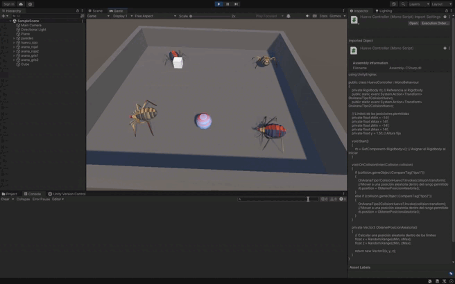

# README: Mecánica de Recolección de Huevos y Puntuación

## Descripción del Ejercicio

En este ejercicio se implementa una mecánica de recolección de huevos en una escena con arañas de dos tipos. Las arañas interactúan con los huevos y actualizan la puntuación del jugador según las siguientes reglas:

1. **Huevos**:
   - Al recolectar un huevo:
     - Las arañas de tipo 1 suman 5 puntos.
     - Las arañas de tipo 2 suman 10 puntos.

2. **Puntuación**:
   - La puntuación acumulada se actualiza y se muestra en la consola cada vez que se recolecta un huevo.

---

## Implementación

### 1. Configuración de la Escena

#### **Huevos**
- **Tag**: `huevo`
- **Componentes**:
  - `Rigidbody` cinemático.
  - `Collider` configurado como `IsTrigger` para detectar colisiones con las arañas.
- **Script**:
  - Maneja la detección de colisiones con arañas tipo 1 y tipo 2 y actualiza la puntuación.

#### **Arañas de Tipo 1**
- **Tag**: `tipo1`
- **Componentes**:
  - `Rigidbody` cinemático.
  - `Collider` para detectar colisiones.
- **Script**:
  - No necesitan lógica adicional para este ejercicio, pero deben interactuar con los huevos.

#### **Arañas de Tipo 2**
- **Tag**: `tipo2`
- **Componentes**:
  - `Rigidbody` cinemático.
  - `Collider` para detectar colisiones.
- **Script**:
  - Igual que las arañas de tipo 1, pero suman más puntos al interactuar con los huevos.

---

### 2. Lógica de los Scripts

#### **HuevoController**
- Detecta colisiones con arañas.
- Identifica el tipo de araña (`tipo1` o `tipo2`) mediante su tag.
- Actualiza la puntuación acumulada y la muestra en la consola.

#### **CuboController (Opcional)**
- Maneja la posición del jugador o eventos adicionales, pero no es esencial para este ejercicio.

---

### 3. Flujo de Ejecución

1. **Colisión con un Huevo**:
   - Si una araña de tipo 1 colisiona con un huevo, se suman 5 puntos a la puntuación.
   - Si una araña de tipo 2 colisiona con un huevo, se suman 10 puntos.

2. **Mostrar la Puntuación**:
   - La puntuación acumulada se imprime en la consola cada vez que se recolecta un huevo.

