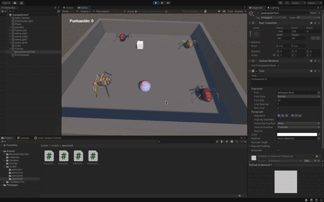

# README: Interfaz para Mostrar la Puntuación del Cubo

## Descripción del Ejercicio

Este ejercicio extiende la mecánica de recolección de huevos para mostrar la puntuación acumulada en una interfaz gráfica. La puntuación se actualiza dinámicamente a medida que las arañas interactúan con los huevos.

1. **Huevos**:
   - Al ser recolectados, las arañas de tipo 1 suman 5 puntos, y las arañas de tipo 2 suman 10 puntos.

2. **Interfaz Gráfica (UI)**:
   - La puntuación acumulada del jugador se muestra en tiempo real en la pantalla.

---

## Implementación

### 1. Configuración de la Escena

#### **Huevos**
- **Tag**: `huevo`
- **Componentes**:
  - `Rigidbody` cinemático.
  - `Collider` configurado como `IsTrigger` para detectar colisiones con las arañas.
- **Script**:
  - Maneja la detección de colisiones con arañas tipo 1 y tipo 2 y notifica al controlador principal para actualizar la puntuación.

#### **Arañas**
- **Tags**: 
  - `tipo1` para arañas de tipo 1.
  - `tipo2` para arañas de tipo 2.
- **Componentes**:
  - `Rigidbody` cinemático.
  - `Collider` configurado para detectar colisiones con los huevos.

#### **Interfaz de Puntuación**
1. **Crear el Canvas**:
   - Ve a **GameObject > UI > Canvas**.
2. **Añadir un Texto**:
   - Dentro del Canvas, añade un objeto de texto (**GameObject > UI > Text**) para mostrar la puntuación.
   - Renombra el texto a `PuntuacionText`.
   - Configura el texto para que sea visible y esté en una posición adecuada.

---

### 2. Lógica de los Scripts

#### **HuevoController**
- Detecta colisiones con las arañas.
- Actualiza la puntuacion dependiendo de que evento se haya activado

