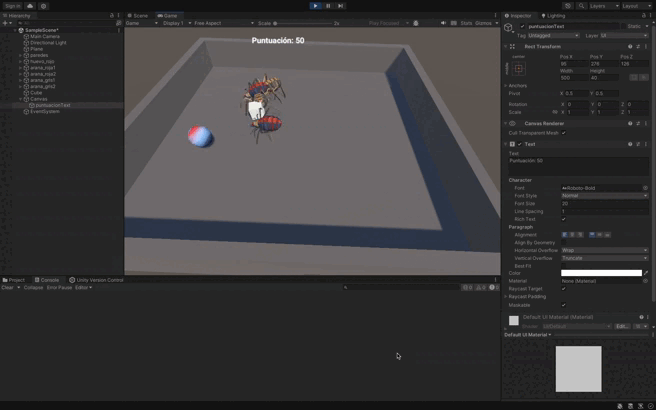

# README: Mensaje de Felicitación por Cada 100 Puntos

## Descripción del Ejercicio

En esta extensión de los ejercicios anteriores, se implementa una mecánica que felicita al jugador cada vez que alcanza 100 puntos o múltiplos de 100. El mensaje de felicitación se muestra en la consola y/o en la interfaz gráfica.

1. **Huevos**:
   - Las arañas recolectan huevos y la puntuación se actualiza:
     - Arañas de tipo 1 suman 5 puntos.
     - Arañas de tipo 2 suman 10 puntos.

2. **Mensaje de Felicitación**:
   - Cuando la puntuación alcanza 100 se muestra un mensaje de felicitación.

---

## Implementación

### 1. Configuración de la Escena

#### **Huevos**
- **Tag**: `huevo`
- **Componentes**:
  - `Rigidbody` cinemático.
  - `Collider`
- **Script**:
  - Maneja la detección de colisiones con arañas tipo 1 y tipo 2 y actualiza la puntuación.

#### **Arañas**
- **Tags**: 
  - `tipo1` para arañas de tipo 1.
  - `tipo2` para arañas de tipo 2.
- **Componentes**:
  - `Rigidbody` cinemático.
  - `Collider` configurado para detectar colisiones con los huevos.

#### **Interfaz de Puntuación**
1. **Crear el Canvas**:
   - Ve a **GameObject > UI > Canvas**.
2. **Añadir un Texto**:
   - Dentro del Canvas, añade un objeto de texto (**GameObject > UI > Text**) para mostrar la puntuación.
   - Renombra el texto a `PuntuacionText`.
   - Configura el texto para que sea visible y esté en una posición adecuada.

---

### 2. Lógica de los Scripts

#### **HuevoController**
- Detecta colisiones con las arañas.
- Notifica al controlador principal para actualizar la puntuación.
- Escucha los cambios en la puntuación, actualiza el texto y muestra un mensaje de felicitación cuando se alcanzan 100 puntos o más.

